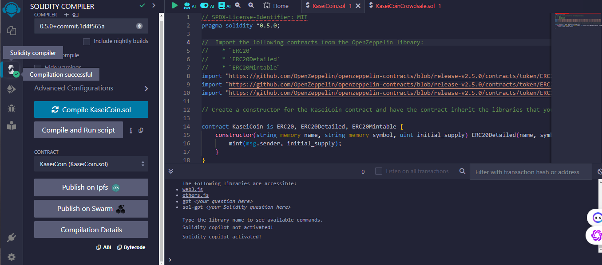
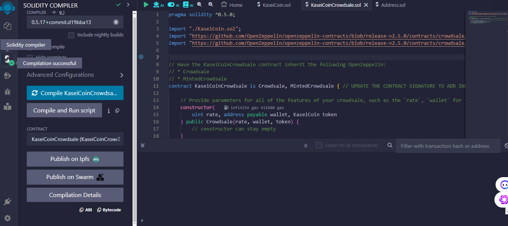
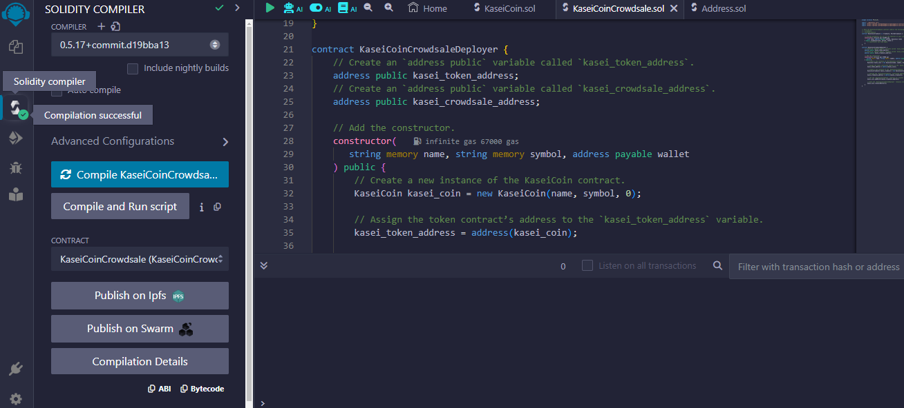

# KaseiCoin Crowdsale

## Background

After years of training and tests, the Martian Aerospace Agency selected you to join the first human colony on Mars. As a prominent fintech professional, you were chosen to lead the development of a monetary system for the Mars colony. You decided to base this system on blockchain technology and create a new cryptocurrency named **KaseiCoin** (Kasei means "Mars" in Japanese).

Kasei Coin will be a fungible token that’s ERC-20 compliant, enabling users to participate in a crowdsale to convert their earth currency into KaseiCoin.

## Instructions

The assignment steps are divided into the following sections:

1. **Create the KaseiCoin Token Contract**
2. **Create the KaseiCoin Crowd sale Contract**
3. **Create the KaseiCoin Deployer Contract**
4. **Deploy and Test the Crowd sale on a Local Blockchain**
5. **Optional: Extend the Crowd sale Contract with OpenZeppelin**
   - This optional step allows you to extend the functionality of the crowd sale contract by adding time restrictions, refund capabilities, and a cap for the total number of tokens. This section is not required but is designed to further your professional development. If you have questions, consult your instructional team.

## Evaluation Evidence

To verify that you've successfully implemented the KaseiCoin contracts, you must provide the following evidence:

[Link to Evaluation Video](Evaluation.mp4)
